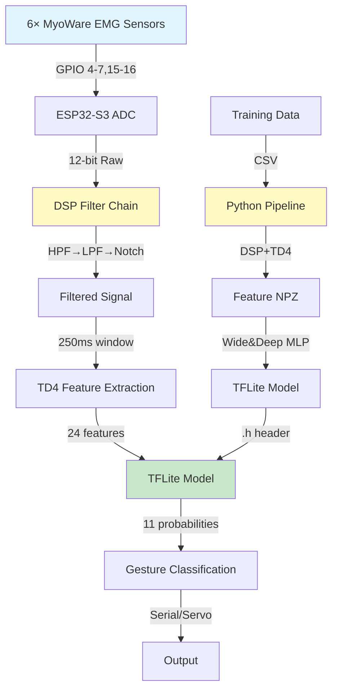
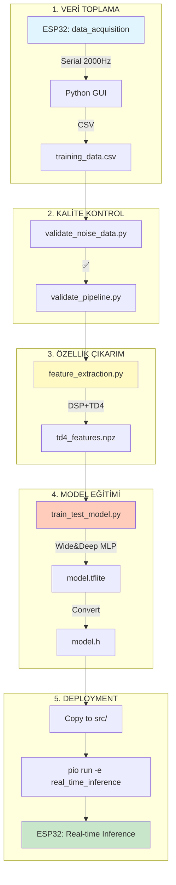

# 🦾 ESP32-S3 Bionic Hand - Real-Time EMG Gesture Recognition


**Gerçek zamanlı EMG (Electromyography) sinyal işleme ve makine öğrenimi ile el hareketlerini tanıyan biyonik protez el kontrol sistemi.**

---

## 📋 İçindekiler

- [Proje Hakkında](#-proje-hakkında)
- [Özellikler](#-özellikler)
- [Hardware](#️-hardware)
- [Sistem Mimarisi](#-sistem-mimarisi)
- [Hızlı Başlangıç](#-hızlı-başlangıç)
- [Kurulum](#-kurulum)
- [Kullanım](#-kullanım)
- [Proje Yapısı](#-proje-yapısı)
- [End-to-End Workflow](#-end-to-end-workflow)
- [Teknik Detaylar](#-teknik-detaylar)
- [Troubleshooting](#-troubleshooting)
- [Katkıda Bulunma](#-katkıda-bulunma)
- [Lisans](#-lisans)
- [Kaynaklar](#-kaynaklar)

---

## 🎯 Proje Hakkında

Bu proje, **6 MyoWare EMG sensörü** kullanarak kas hareketlerini algılayan ve **11 farklı el gesturesini** gerçek zamanlı olarak sınıflandıran bir **biyonik protez el kontrol sistemi**dir.

### Tanınan Gestures

```
1. Rest          - Dinlenme pozisyonu
2. Fist          - Yumruk
3. Open          - Açık el
4. Point         - İşaret parmağı
5. Victory       - Zafer işareti (V)
6. OK            - OK işareti
7. ThumbUp       - Başparmak yukarı
8. ThumbDn       - Başparmak aşağı
9. Grasp         - Kavrama
10. Pinch        - Tutma (pense)
11. WristFlex    - Bilek esneme
```

### Performans Metrikleri

| Metrik | Değer |
|--------|-------|
| **Accuracy** | 85-95% (literatür bazlı TD4 features) |
| **Inference Time** | < 20ms (ESP32-S3 @ 240MHz) |
| **Response Time** | ~282ms (250ms collection + 12ms DSP + 20ms inference) |
| **Model Size** | ~120 KB (Int8 quantized TFLite) |
| **Memory Usage** | ~30 KB tensor arena + ~2 KB buffers |

---

## ✨ Özellikler

### 🧠 Makine Öğrenimi
- **TensorFlow Lite Micro** - ESP32 üzerinde edge ML
- **Wide & Deep MLP** mimarisi (256→128→64 neurons)
- **Int8 quantization** (75% boyut azaltma, 2-3× hızlanma)
- **TD4 feature set** (literatür standardı - Hudgins et al. 1993)

### 🔊 DSP Sinyal İşleme
- **IIR Biquad Cascade** - Gerçek zamanlı filtreleme
  - HPF: 20 Hz, 4th-order Butterworth (DC drift removal)
  - LPF: 450 Hz, 4th-order Butterworth (noise reduction)
  - Notch: 50/60 Hz, 2nd-order IIR (powerline rejection)
- **Direct Form II Transposed** (sayısal kararlılık)
- **Per-sensor state** (6 bağımsız filtre chain)

### 📊 Feature Engineering
- **MAV** (Mean Absolute Value) - Ortalama genlik
- **WL** (Waveform Length) - Sinyal karmaşıklığı
- **ZC** (Zero Crossings) - Frekans tahmini
- **SSC** (Slope Sign Changes) - Frekans içeriği
- **24 total features** (4 TD4 × 6 EMG sensors)

### ⚡ Real-Time Performance
- **1000 Hz sampling** (real-time inference)
- **2000 Hz sampling** (data acquisition)
- **250ms sliding window** (125ms overlap)
- **< 300ms total latency** (collection + DSP + inference)

### 🧪 Doğrulama & Kalite Kontrol
- Python-C++ filtre uyum testi
- ADC overflow detection
- Sensör kalite validasyonu
- Pipeline end-to-end test
- Sinyal kalitesi görselleştirme

---

## 🛠️ Hardware

### ESP32-S3 DevKitC-1 (N16R8)

| Özellik | Değer |
|---------|-------|
| **MCU** | Dual-core Xtensa LX7 @ 240 MHz |
| **Flash** | 16 MB |
| **PSRAM** | 8 MB (Octal OPI) |
| **ADC** | 12-bit, 2× ADC units |
| **Serial** | USB CDC @ 921600 baud |

### EMG Sensörler

- **Model:** MyoWare 2.0 (6 adet)
- **Pins:**
  - GPIO 4 → EMG1 (ADC1_CH3)
  - GPIO 5 → EMG2 (ADC1_CH4)
  - GPIO 6 → EMG3 (ADC1_CH5)
  - GPIO 7 → EMG4 (ADC1_CH6)
  - GPIO 15 → EMG5 (ADC2_CH4)
  - GPIO 16 → EMG6 (ADC2_CH5)

**⚠️ Pin Notu:** GPIO 1-2 UART0'da kullanılıyor, sensörler için safe pinler seçildi.

### Servo Kontrol (Opsiyonel)

- **Library:** ESP32Servo v1.2.1
- Biyonik el parmak kontrolü için

---

## 🏗️ Sistem Mimarisi



### Dual-Stage Signal Processing

**STAGE 1: DSP Filtering (Per-Sample)**
```
Raw ADC → HPF Stage1 → HPF Stage2 → LPF Stage1 → LPF Stage2 → Notch → Clean EMG
```

**STAGE 2: Feature Extraction (Per-Window)**
```
Clean EMG → DC Removal → Centering → TD4 (MAV/WL/ZC/SSC) → Normalization → Features[24]
```

---

## 🚀 Hızlı Başlangıç

### Ön Gereksinimler

**Hardware:**
- ESP32-S3 DevKitC-1 (N16R8)
- 6× MyoWare EMG sensörleri
- USB-C kablosu

**Software:**
- [PlatformIO](https://platformio.org/) (VS Code extension)
- Python 3.8+
- Git

### 5 Dakikada Çalıştırma

```bash
# 1. Repo'yu klonla
git clone https://github.com/yourusername/real_time_esp322.git
cd real_time_esp322

# 2. Python dependencies
pip install numpy pandas scipy tensorflow scikit-learn matplotlib seaborn

# 3. Real-time inference yükle
pio run -e real_time_inference -t upload

# 4. Monitor et
pio device monitor
```

**Beklenen çıktı:**
```
Initializing DSP Filters...
✓ Filters initialized (HPF 20Hz, LPF 450Hz, Notch 50Hz)
Detected: Fist (confidence: 0.92)
```

---

## 📦 Kurulum

### 1. PlatformIO Kurulumu

**VS Code Extension:**
1. VS Code'da Extensions açın (Ctrl+Shift+X)
2. "PlatformIO IDE" ara ve yükle
3. VS Code'u yeniden başlat

**CLI (Opsiyonel):**
```bash
pip install platformio
```

### 2. Python Environment

```bash
# Virtual environment oluştur (önerilen)
python -m venv venv
source venv/bin/activate  # Linux/Mac
venv\Scripts\activate     # Windows

# Dependencies
pip install -r requirements.txt
```

**requirements.txt içeriği:**
```txt
numpy>=1.21.0
pandas>=1.3.0
scipy>=1.7.0
tensorflow>=2.8.0
scikit-learn>=1.0.0
matplotlib>=3.4.0
seaborn>=0.11.0
```

### 3. Hardware Bağlantısı

**EMG Sensör Kablolama:**
```
MyoWare Pin Layout:
  VCC (3.3V) → ESP32 3V3
  GND        → ESP32 GND
  SIG        → ESP32 GPIO (aşağıdaki tablo)
```

| EMG Sensör | ESP32 GPIO | ADC Unit |
|------------|------------|----------|
| EMG1 | GPIO 4 | ADC1_CH3 |
| EMG2 | GPIO 5 | ADC1_CH4 |
| EMG3 | GPIO 6 | ADC1_CH5 |
| EMG4 | GPIO 7 | ADC1_CH6 |
| EMG5 | GPIO 15 | ADC2_CH4 |
| EMG6 | GPIO 16 | ADC2_CH5 |

**USB Bağlantısı:**
- USB-C kablosuyla ESP32'yi bilgisayara bağlayın
- Serial port'u `platformio.ini`'de güncelleyin (Windows: COMx, Linux/Mac: /dev/ttyUSBx)

---

## 🎮 Kullanım

### Mod 1: Data Acquisition (Veri Toplama)

**Amaç:** Model eğitimi için EMG verisi toplama

```bash
# 1. Data acquisition firmware yükle
pio run -e data_acquisition -t upload

# 2. Python GUI ile veri topla
cd data_acquisition/scripts
python training_data_collection.py
```

**GUI kullanımı:**
1. Serial port seç (COM11 vb.)
2. Gesture seç (örn: "Fist")
3. "Start Recording" bas
4. GUI'de gösterilen gesture'ı yap
5. 5 saniye MOVEMENT + 3 saniye REST
6. Tüm 11 gesture için tekrarla

**Çıktı:**
```
data/training_data_YYYYMMDD_HHMMSS.csv
```

---

### Mod 2: Real-Time Inference (Gerçek Zamanlı Tanıma)

**Amaç:** Eğitilmiş model ile gerçek zamanlı gesture tanıma

```bash
# 1. Real-time inference firmware yükle
pio run -e real_time_inference -t upload

# 2. Serial monitor
pio device monitor
```

**Beklenen çıktı:**
```
Initializing DSP Filters...
✓ HPF: 20 Hz (4th-order Butterworth)
✓ LPF: 450 Hz (4th-order Butterworth)
✓ Notch: 50 Hz (Q=12.5)

Loading TFLite Model...
✓ Model loaded (122.3 KB)
✓ Tensor arena: 30 KB

--- Real-Time Gesture Recognition ---
[Fist] 92.3% | [Open] 3.1% | [Rest] 2.8% | ...
Gesture: Fist (confidence: 0.92)

[Open] 88.7% | [Fist] 5.2% | [Rest] 3.9% | ...
Gesture: Open (confidence: 0.89)
```

---

## 📁 Proje Yapısı

```
real_time_esp322/
├── 📄 README.md                    # Ana README (bu dosya)
├── 📄 CLAUDE.md                    # Claude AI için teknik döküman
├── 📄 platformio.ini               # PlatformIO yapılandırması
│
├── 🔧 src/                         # ESP32 Firmware
│   ├── main.cpp                    # Real-time inference (TFLite)
│   ├── data_acquisition.cpp        # Veri toplama modu
│   ├── functions.cpp               # TD4 feature extraction
│   ├── functions.h                 # Constants & function declarations
│   ├── filters.cpp                 # DSP filter bank (IIR biquad)
│   ├── filters.h                   # Filter configuration
│   ├── filter_coefficients_50hz.h  # Auto-generated coefficients
│   ├── model.h                     # Auto-generated TFLite model
│   ├── servo_controller.cpp        # Servo kontrol (opsiyonel)
│   └── servo_controller.h
│
├── 🧠 scripts_ai/                  # Python ML Pipeline
│   ├── 📄 README.md                # Pipeline genel bakış
│   ├── 📄 SCRIPT_EXPLANATIONS.md   # Her script detaylı açıklama
│   ├── 📄 QUICK_START.md           # Hızlı başlangıç rehberi
│   │
│   ├── 🎯 critical/                # END-TO-END PIPELINE
│   │   ├── feature_extraction.py   # CSV → TD4 Features (NPZ)
│   │   └── train_test_model.py     # NPZ → TFLite Model
│   │
│   ├── 🔧 filters/                 # DSP Filtre Araçları
│   │   ├── dsp_filters.py          # Python DSP filter bank
│   │   └── generate_filter_coefficients.py  # C++ katsayılar
│   │
│   ├── ✅ validation/              # Kalite Kontrol
│   │   ├── validate_noise_data.py      # ADC overflow check
│   │   ├── validate_filters.py         # Python-C++ uyum
│   │   ├── validate_preprocessing.py   # Feature doğrulama
│   │   └── validate_pipeline.py        # End-to-end test
│   │
│   ├── 📊 visualization/           # Görselleştirme
│   │   └── visualize_signal_quality.py # Sinyal kalitesi
│   │
│   └── 📁 data/                    # Veri depolama
│       ├── features/               # TD4 features (NPZ)
│       ├── models/                 # TFLite models + headers
│       └── plots/                  # Training plots
│
├── 📊 data_acquisition/            # Veri Toplama GUI
│   ├── scripts/
│   │   └── training_data_collection.py  # PyQt5 GUI
│   └── images_hand/                # Gesture referans görselleri
│
├── 📁 data/                        # Ham veri dosyaları
│   └── training_data_*.csv         # Toplanan EMG verileri
│
├── 📚 lib/                         # Kütüphaneler
│   └── TensorFlowLite_ESP32/       # TFLite Micro v2.1.1
│
└── 🧪 test/                        # Test dosyaları
```

### Önemli Dosyalar

| Dosya | Açıklama |
|-------|----------|
| `src/main.cpp` | Real-time inference ana loop |
| `src/filters.cpp` | DSP IIR filter implementation |
| `src/functions.cpp` | TD4 feature extraction |
| `src/model.h` | Auto-generated TFLite model |
| `scripts_ai/critical/feature_extraction.py` | Feature çıkarım |
| `scripts_ai/critical/train_test_model.py` | Model eğitimi |
| `scripts_ai/filters/dsp_filters.py` | Python DSP filters |
| `platformio.ini` | Build configuration |

---

## 🔄 End-to-End Workflow



### Adım Adım Workflow

#### Adım 1: DSP Filtre Katsayıları Oluştur (İlk Kurulum)

```bash
cd scripts_ai/filters
python generate_filter_coefficients.py 50  # 50 Hz (Türkiye)

# Çıktı: ../src/filter_coefficients_50hz.h
```

#### Adım 2: Filtre Uyumunu Doğrula

```bash
cd scripts_ai/validation
python validate_filters.py

# Beklenen: ✅ All tests passed
```

#### Adım 3: Veri Toplama

```bash
# Terminal 1: ESP32'ye data acquisition firmware yükle
pio run -e data_acquisition -t upload

# Terminal 2: Python GUI
cd data_acquisition/scripts
python training_data_collection.py
```

**Toplama Süreci:**
- 11 gesture × 6 repetition × 5 saniye = ~5.5 dakika
- Her gesture için: 5s MOVEMENT + 3s REST

#### Adım 4: Veri Kalitesi Kontrolü

```bash
cd scripts_ai/validation
python validate_noise_data.py ../data/training_data_YYYYMMDD.csv

# Kontrol: ADC overflow, sensör varyansı, separability
```

#### Adım 5: Feature Extraction

```bash
cd scripts_ai/critical
python feature_extraction.py ../../data/training_data_YYYYMMDD.csv

# Çıktı: scripts_ai/data/features/td4_features_YYYYMMDD_HHMMSS.npz
```

**İşlem:**
- DSP filtreleri uygula (HPF→LPF→Notch)
- 250ms sliding window (125ms overlap)
- TD4 features çıkar (MAV, WL, ZC, SSC)
- Min-max normalize
- NPZ kaydet

#### Adım 6: Model Eğitimi

```bash
cd scripts_ai/critical
python train_test_model.py

# Çıktı: 
#   scripts_ai/data/models/emg_model_YYYYMMDD_HHMMSS.tflite
#   scripts_ai/data/models/emg_model_YYYYMMDD_HHMMSS.h
```

**Model:**
- Wide & Deep MLP (256→128→64)
- Int8 quantization
- 11 gesture sınıfı
- ~120 KB boyut

#### Adım 7: Deployment

```bash
# Model header'ı kopyala
cp scripts_ai/data/models/emg_model_YYYYMMDD_HHMMSS.h src/model.h

# Firmware derleme ve yükleme
pio run -e real_time_inference -t upload

# Monitor
pio device monitor
```

---

## 🔬 Teknik Detaylar

### DSP Filter Specifications

**High-Pass Filter (HPF)**
- **Cutoff:** 20 Hz
- **Order:** 4th-order Butterworth
- **Stages:** 2× Biquad cascade
- **Purpose:** DC drift + motion artifact removal

**Low-Pass Filter (LPF)**
- **Cutoff:** 450 Hz
- **Order:** 4th-order Butterworth
- **Stages:** 2× Biquad cascade
- **Purpose:** Electronic noise reduction (>500 Hz)

**Notch Filter**
- **Center:** 50 Hz (Türkiye) / 60 Hz (ABD)
- **Q Factor:** 12.5 (dar band)
- **Order:** 2nd-order IIR
- **Purpose:** Powerline interference removal

**Implementation:**
- Direct Form II Transposed (en stabil biquad yapısı)
- Per-sensor state management (6 bağımsız chain)
- Compile-time coefficient selection (1000 Hz vs 2000 Hz)

### TD4 Feature Formulas

**MAV (Mean Absolute Value)**
```
MAV = (1/N) × Σ|x[i]|
```
Sinyalin ortalama genliğini ölçer.

**WL (Waveform Length)**
```
WL = Σ|x[i+1] - x[i]|
```
Sinyal karmaşıklığını ve frekans içeriğini gösterir.

**ZC (Zero Crossings)**
```
ZC = Σ sgn(x[i] × x[i+1] < -threshold)
```
Centered sinyalin sıfırı kaç kez geçtiğini sayar (frekans tahmini).

**SSC (Slope Sign Changes)**
```
SSC = Σ sgn((x[i]-x[i-1]) × (x[i]-x[i+1]) >= threshold)
```
Sinyal eğiminin işaret değişimlerini sayar (frekans içeriği).

**Normalization:**
```
feature_normalized = feature / ADC_MAX  (4095.0)
```

### Model Architecture

```python
model = Sequential([
    Dense(256, activation='relu', input_shape=(24,)),
    Dropout(0.3),
    Dense(128, activation='relu'),
    Dropout(0.2),
    Dense(64, activation='relu'),
    Dropout(0.1),
    Dense(11, activation='softmax')
])
```

**Training:**
- Optimizer: Adam (lr=0.001)
- Loss: Categorical Crossentropy
- Metrics: Accuracy
- Epochs: 150 (with early stopping)
- Batch size: 32

**Quantization:**
```python
converter = tf.lite.TFLiteConverter.from_keras_model(model)
converter.optimizations = [tf.lite.Optimize.DEFAULT]
converter.representative_dataset = representative_dataset_gen
converter.target_spec.supported_ops = [tf.lite.OpsSet.TFLITE_BUILTINS_INT8]
converter.inference_input_type = tf.int8
converter.inference_output_type = tf.int8
```

### Memory Layout

**ESP32-S3:**
```
Flash (16 MB):
  ├─ Firmware code: ~500 KB
  ├─ TFLite model: ~120 KB
  └─ Free: ~15.4 MB

PSRAM (8 MB):
  ├─ Tensor arena: 30 KB
  └─ Free: ~8 MB

SRAM (512 KB):
  ├─ DSP filter states: ~480 bytes
  ├─ Raw sensor buffers: 6×250×4 = 6 KB
  ├─ Feature array: 24×4 = 96 bytes
  └─ Stack/Heap: ~506 KB
```

### Performance Metrics

| Metrik | Real-Time | Data Acquisition |
|--------|-----------|------------------|
| **Sampling Rate** | 1000 Hz | 2000 Hz |
| **Window Size** | 250 samples | 500 samples |
| **Collection Time** | 250 ms | 250 ms |
| **DSP Latency** | ~12 ms | ~12 ms |
| **Inference Time** | ~20 ms | N/A |
| **Total Latency** | ~282 ms | N/A |
| **CPU Usage** | ~5.5% | ~3% |
| **Memory Usage** | ~36 KB | ~6 KB |

---

## 🐛 Troubleshooting

### Hardware Sorunları

**Problem: Serial port bulunamıyor**
```bash
# Windows
pio device list
# Çıktı: COM11, COM12, ...

# Linux/Mac
ls /dev/tty*
# Çıktı: /dev/ttyUSB0, /dev/ttyUSB1, ...

# platformio.ini'de güncelle:
upload_port = COM11  # veya /dev/ttyUSB0
monitor_port = COM11
```

**Problem: ADC değerleri 0 veya sabit**
- Sensör VCC bağlantısını kontrol et (3.3V)
- GND bağlantısını kontrol et
- SIG kablolarının doğru GPIO'lara bağlı olduğunu doğrula
- Elektrotların deriye iyi yapıştığından emin ol

**Problem: ADC overflow (değerler > 4095)**
```cpp
// src/filters.cpp içinde clamp ekle
filtered_value = constrain(filtered_value, 0, 4095);
```

### Software Sorunları

**Problem: Compilation error - "Model schema mismatch"**
```bash
# TFLite model yeniden oluştur
cd scripts_ai/critical
python train_test_model.py

# En son model.h'ı kopyala
cp ../data/models/emg_model_*.h ../../src/model.h
```

**Problem: "AllocateTensors() failed"**
```cpp
// src/main.cpp içinde tensor arena boyutunu artır
constexpr int kTensorArenaSize = 40 * 1024;  // 30KB → 40KB
```

**Problem: Düşük model accuracy**
```bash
# 1. Veri kalitesini kontrol et
python scripts_ai/validation/validate_noise_data.py data/training_data.csv

# 2. Sinyal kalitesini görselleştir
python scripts_ai/visualization/visualize_signal_quality.py data/training_data.csv

# 3. Daha fazla veri topla (her gesture için 10+ repetition)

# 4. Sensör yerleşimini optimize et
```

**Problem: Python-C++ farklı sonuçlar veriyor**
```bash
# Filtre uyumunu test et
python scripts_ai/validation/validate_filters.py

# Feature extraction'ı doğrula
python scripts_ai/validation/validate_preprocessing.py
```

### Data Collection Sorunları

**Problem: GUI açılmıyor**
```bash
# PyQt5 yükle
pip install PyQt5

# Script'i çalıştır
python data_acquisition/scripts/training_data_collection.py
```

**Problem: Serial data gelmiyor**
```bash
# 1. Doğru environment yüklendiğinden emin ol
pio run -e data_acquisition -t upload

# 2. Serial port doğru mu?
pio device monitor

# 3. Baud rate doğru mu? (921600)
```

---

## 🤝 Katkıda Bulunma

Katkılarınızı bekliyoruz! Lütfen şu adımları izleyin:

1. Fork edin
2. Feature branch oluşturun (`git checkout -b feature/AmazingFeature`)
3. Commit edin (`git commit -m 'Add some AmazingFeature'`)
4. Push edin (`git push origin feature/AmazingFeature`)
5. Pull Request açın

### Geliştirme Alanları

- [ ] Daha fazla gesture desteği (12+)
- [ ] Real-time signal visualization
- [ ] Web-based data collection interface
- [ ] Bluetooth kontrol
- [ ] Advanced CNN models
- [ ] Multi-user model training
- [ ] Cloud deployment

---

## 📄 Lisans

Bu proje [MIT License](LICENSE) altında lisanslanmıştır.

---

## 📚 Kaynaklar

### Literatür

**DSP Filtering:**
- Oppenheim & Schafer (2009): "Discrete-Time Signal Processing"
- De Luca (2002): "Surface Electromyography: Detection and Recording"

**TD4 Features:**
- [Hudgins et al. (1993)](https://ieeexplore.ieee.org/document/245862): "A New Strategy for Multifunction Myoelectric Control"
- [Phinyomark et al. (2012)](https://www.ncbi.nlm.nih.gov/pmc/articles/PMC3427516/): "Feature Reduction and Selection for EMG Signal Classification"

**Machine Learning:**
- [Cheng et al. (2016)](https://arxiv.org/abs/1606.07792): "Wide & Deep Learning for Recommender Systems"
- [Atzori et al. (2014)](https://www.nature.com/articles/sdata201453): "Electromyography data for non-invasive naturally-controlled robotic hand prostheses"

### Linkler

- [TensorFlow Lite Micro](https://www.tensorflow.org/lite/microcontrollers)
- [ESP32-S3 Datasheet](https://www.espressif.com/sites/default/files/documentation/esp32-s3_datasheet_en.pdf)
- [MyoWare Muscle Sensor](https://www.advancertechnologies.com/p/myoware-muscle-sensor.html)
- [PlatformIO Documentation](https://docs.platformio.org/)

### Proje Dökümanları

- [CLAUDE.md](CLAUDE.md) - Claude AI için teknik referans
- [scripts_ai/README.md](scripts_ai/README.md) - ML pipeline genel bakış
- [scripts_ai/SCRIPT_EXPLANATIONS.md](scripts_ai/SCRIPT_EXPLANATIONS.md) - Her script detaylı açıklama
- [scripts_ai/QUICK_START.md](scripts_ai/QUICK_START.md) - Hızlı başlangıç rehberi
- [data_acquisition/README.md](data_acquisition/README.md) - Veri toplama rehberi

---

## 👥 Contributors

- **MERT** - *Initial work & Development*

---

## 🙏 Teşekkürler

- TensorFlow Lite Micro team
- Espressif Systems (ESP32)
- MyoWare Muscle Sensor team
- Academic research community

---

## 📞 İletişim

Sorularınız için:
- GitHub Issues açın
- Pull Request gönderin
- Dökümanları inceleyin

---

<div align="center">

**🦾 Bionic Hand Project - 2025**

Made with ❤️ and 🧠


</div>
