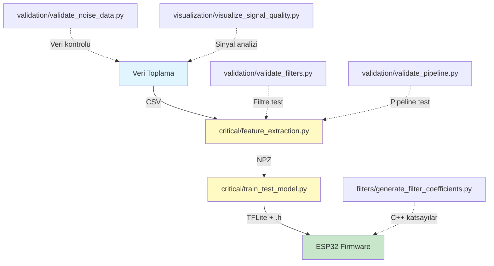

# scripts_ai - EMG Signal Processing & ML Pipeline

Bu klasör, ESP32-S3 Bionic Hand projesi için makine öğrenimi pipeline'ını içerir.

## 📂 Klasör Yapısı

```
scripts_ai/
├── critical/          # 🎯 CORE END-TO-END PIPELINE (Ana işlem hattı)
├── filters/           # 🔧 DSP Filtre Araçları
├── validation/        # ✅ Veri Kalite Kontrol Araçları
├── visualization/     # 📊 Görselleştirme Araçları
└── data/              # 📁 Veri klasörü (features, models vb.)
```

## 🚀 Hızlı Başlangıç - End-to-End İşlem Hattı

### Adım 1: Veri Toplama
```bash
# data_acquisition/scripts/training_data_collection.py kullanarak veri topla
python data_acquisition/scripts/training_data_collection.py
```

### Adım 2: Özellik Çıkarımı (Feature Extraction)
```bash
python scripts_ai/critical/feature_extraction.py path/to/training_data.csv
```
**Çıktı:** `data/features/td4_features_YYYYMMDD_HHMMSS.npz`

### Adım 3: Model Eğitimi (Train & Test)
```bash
python scripts_ai/critical/train_test_model.py --cv
```
**Çıktı:** 
- `data/models/emg_model_YYYYMMDD_HHMMSS.tflite` (ESP32 için)
- `data/models/emg_model_YYYYMMDD_HHMMSS.h` (C++ header)

---

## 📁 Detaylı Klasör Açıklamaları

### 🎯 critical/ - Ana İşlem Hattı
**Amacı:** Veri toplamadan model çıktısına kadar tüm kritik adımlar.

| Script | Ne İşe Yarar |
|--------|--------------|
| `feature_extraction.py` | CSV verilerinden TD4 özellikleri çıkarır |
| `train_test_model.py` | ML modelini eğitir ve TFLite'a dönüştürür |

**Detaylar:** [critical/README.md](critical/README.md)

---

### 🔧 filters/ - DSP Filtre Araçları
**Amacı:** Python ve C++ için DSP filtre tasarımı ve katsayı üretimi.

| Script | Ne İşe Yarar |
|--------|--------------|
| `dsp_filters.py` | Python DSP filtre kütüphanesi (HPF, LPF, Notch) |
| `generate_filter_coefficients.py` | C++ için filtre katsayıları üretir |

**Detaylar:** [filters/README.md](filters/README.md)

---

### ✅ validation/ - Veri Kalite Kontrol
**Amacı:** Veri kalitesi, filtre doğruluk, ve pipeline test araçları.

| Script | Ne İşe Yarar |
|--------|--------------|
| `validate_noise_data.py` | ADC overflow ve sensör sorunlarını tespit eder |
| `validate_filters.py` | Python-C++ filtre uyumunu test eder |
| `validate_preprocessing.py` | Ön işleme pipeline'ını doğrular |
| `validate_pipeline.py` | Tüm pipeline'ın veri akışını kontrol eder |

**Detaylar:** [validation/README.md](validation/README.md)

---

### 📊 visualization/ - Görselleştirme
**Amacı:** Sinyal kalitesi analizi ve veri görselleştirme.

| Script | Ne İşe Yarar |
|--------|--------------|
| `visualize_signal_quality.py` | EMG sinyallerinin kalitesini görselleştirir |

**Detaylar:** [visualization/README.md](visualization/README.md)

---

## 🔄 Tam İş Akışı (Full Workflow)



---

## 🛠️ Geliştirici Notları

### Filtre Pipeline'ı
1. **Python tarafı:** `filters/dsp_filters.py` - Training için filtreler
2. **C++ tarafı:** `src/filters.cpp` - ESP32 için filtreler
3. **Katsayılar:** `filters/generate_filter_coefficients.py` ile senkronize

### Feature Engineering
- **TD4 özellikleri:** MAV, WL, ZC, SSC (literatür standardı)
- **Window:** 250ms, 125ms overlap
- **Normalization:** Global ADC Max (4095)

### Model Mimarisi
- **Tip:** Wide & Deep MLP
- **Giriş:** 24 features (6 EMG × 4 TD4)
- **Çıkış:** 11 gesture classes

---

## 📚 Ek Kaynaklar

- **Hudgins et al. (1993):** "A New Strategy for Multifunction Myoelectric Control"
- **Phinyomark et al. (2012):** "Feature Reduction and Selection for EMG Signal Classification"

---

## ⚠️ Önemli Notlar

1. **ADC Overflow:** Eğitim verileri toplamadan önce `validation/validate_noise_data.py` ile kontrol edin
2. **Filtre Uyumu:** Python ve C++ filtrelerinin eşleştiğinden emin olun (`validation/validate_filters.py`)
3. **Label Order:** C++ ile Python arasında gesture sırası uyumlu olmalı (Fixed order kullanılıyor)

---

**Proje:** ESP32-S3 Bionic Hand  
**Tarih:** 2025
