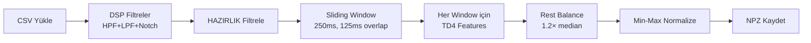
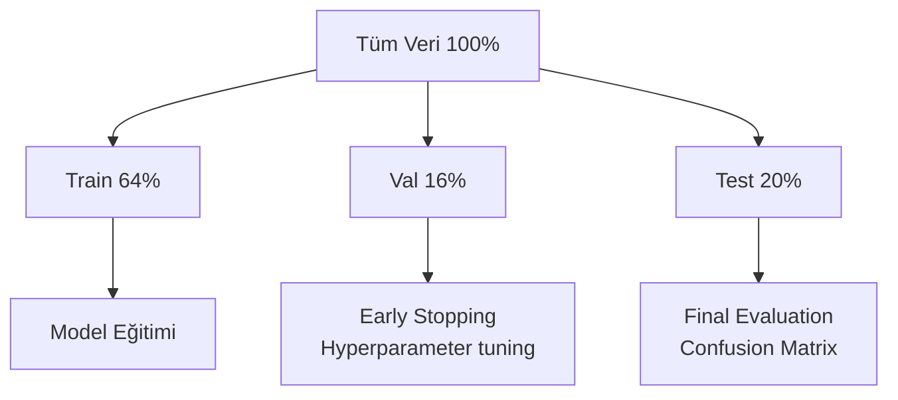
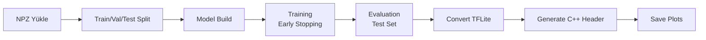

# 🎯 critical/ - Ana İşlem Hattı (End-to-End Pipeline)

Bu klasör, **veri işlemeden model eğitimine** kadar tüm kritik adımları içerir. Projenin çekirdeği burasıdır!

---

## 📋 İçindekiler

| Script | Açıklama | Giriş | Çıkış |
|--------|----------|-------|-------|
| **feature_extraction.py** | TD4 özellikleri çıkarır | CSV (raw EMG) | NPZ (features) |
| **train_test_model.py** | Model eğitir ve TFLite'a dönüştürür | NPZ (features) | TFLite + .h |

---

## 1️⃣ feature_extraction.py

### 🎯 Amacı
Ham EMG verilerinden (CSV) makine öğrenimi için **TD4 özelliklerini** çıkarır.

### 🔬 TD4 Nedir?
**Hudgins et al. (1993)** tarafından önerilen "Gold Standard" EMG özellikleri:

| Özellik | Formül | Açıklama |
|---------|--------|----------|
| **MAV** | Mean Absolute Value | Sinyalin ortalama genliği |
| **WL** | Waveform Length | Sinyalin karmaşıklığı |
| **ZC** | Zero Crossings | Sıfır geçiş sayısı (frekans göstergesi) |
| **SSC** | Slope Sign Changes | Eğim değişim sayısı |

**Çıkan Özellik Sayısı:** 6 EMG × 4 TD4 = **24 feature**

---

### ⚙️ İşlem Adımları



---

### 📥 Giriş Formatı (CSV)

```
Timestamp, EMG1, EMG2, EMG3, EMG4, EMG5, EMG6, Movement, Phase
0,         2048, 2050, 2047, 2049, 2048, 2051, Rest,     HAZIRLIK
500,       2100, 2120, 2110, 2105, 2098, 2115, Fist,     MOVEMENT
...
```

**Gerekli sütunlar:**
- `EMG1` .. `EMG6`: Ham ADC değerleri (0-4095)
- `Movement`: Gesture etiketi (Rest, Fist, Open, vb.)
- `Phase`: HAZIRLIK | MOVEMENT | REST

---

### 📤 Çıkış Formatı (NPZ)

**Dosya adı:** `data/features/td4_features_YYYYMMDD_HHMMSS.npz`

```python
{
    'features': np.array([N_windows, 24]),  # TD4 features
    'labels': np.array([N_windows]),        # Movement labels
    'normalization_params': dict,           # Min-max params
    'feature_names': list,                  # ['MAV_EMG1', 'WL_EMG1', ...]
    'window_config': dict                   # Window settings
}
```

---

### 🚀 Kullanım

#### Temel Kullanım
```bash
python scripts_ai/critical/feature_extraction.py path/to/training_data.csv
```

#### Python'dan Import
```python
from critical.feature_extraction import extract_features_from_csv

output_path = extract_features_from_csv(
    csv_path='data/training_data_20251126.csv',
    output_dir='data/features',
    sensor_columns=['EMG1', 'EMG2', 'EMG3', 'EMG4', 'EMG5', 'EMG6'],
    apply_filters=True,        # DSP filtrelerini uygula
    powerline_freq=50          # 50 Hz Notch (Avrupa)
)
```

---

### ⚙️ Parametreler

| Parametre | Varsayılan | Açıklama |
|-----------|------------|----------|
| `window_size_ms` | 250 | Analiz pencere boyutu (ms) |
| `overlap_ms` | 125 | Pencereler arası örtüşme (ms) |
| `sampling_rate` | 2000 | Örnekleme frekansı (Hz) |
| `zc_threshold_adc` | 15.0 | Zero Crossing eşiği |
| `ssc_threshold_adc` | 15.0 | Slope Sign Change eşiği |
| `apply_filters` | True | DSP filtrelerini uygula |
| `powerline_freq` | 50 | Powerline frekansı (50/60 Hz) |

---

### 🔧 DSP Filtreler

**Filtre Cascade:**
1. **High-Pass:** 20 Hz, 4th-order Butterworth → DC offset kaldırır
2. **Low-Pass:** 450 Hz, 4th-order Butterworth → Yüksek frekans gürültüsü
3. **Notch:** 50/60 Hz, Q=12.5 → Powerline gürültüsü

**Not:** Bu filtreler `filters/dsp_filters.py`'den gelir ve C++ tarafı ile senkronizedir.

---

### ⚖️ Rest Balancing

**Problem:** "Rest" sınıfı genellikle çok fazla örnek içerir.

**Çözüm:**
```python
target_rest_count = median(other_movements) × 1.2
```

Diğer gesture'lardan %20 fazla Rest tutulur, geri kalanı random sampling ile düşürülür.

---

### ⚠️ Önemli Notlar

1. **HAZIRLIK filtrele:** `Phase == 'HAZIRLIK'` olan veriler özellik çıkarımı öncesi atılır
2. **Window mode:** Her window'un en sık görünen Movement'ı label olarak alınır
3. **Normalization:** Global Min-Max (training ve test setinde aynı params kullanılır)
4. **C++ uyumu:** Tüm işlemler ESP32 firmware'i ile aynı sonucu verecek şekilde tasarlanmıştır

---

## 2️⃣ train_test_model.py

### 🎯 Amacı
Çıkarılan özellikleri kullanarak **Wide & Deep MLP** modelini eğitir ve ESP32 için **TFLite** formatına dönüştürür.

---

### 🧠 Model Mimarisi

**Wide & Deep Multi-Layer Perceptron**

```
                  Input (24 features)
                        |
                  Dense(256) + ReLU
                        |
                   Dropout(0.3)
                        |
                  Dense(128) + ReLU
                        |
                   Dropout(0.2)
                        |
                   Dense(64) + ReLU
                        |
                   Dropout(0.1)
                        |
                Dense(11) + Softmax  ← 11 gesture sınıfı
```

**Toplam parametreler:** ~30,000  
**TFLite boyutu:** ~120 KB (Float32)

---

### 📥 Giriş Formatı (NPZ)

**En son TD4 features NPZ dosyasını otomatik bulur:**
```
data/features/td4_features_20251126_010530.npz
```

---

### 📤 Çıkış Formatları

#### 1. TFLite Model (ESP32 için)
**Dosya:** `data/models/emg_model_YYYYMMDD_HHMMSS.tflite`
- Float32 format (maksimum uyumluluk)
- Boyut: ~120 KB
- ESP32 TFLite Micro ile uyumlu

#### 2. C++ Header (Firmware için)
**Dosya:** `data/models/emg_model_YYYYMMDD_HHMMSS.h`
```cpp
#ifndef EMG_MODEL_H
#define EMG_MODEL_H

const unsigned char emg_model_tflite[] = {
    0x1c, 0x00, 0x00, 0x00, 0x54, 0x46, 0x4c, 0x33, ...
};
const unsigned int emg_model_tflite_len = 123456;

#endif
```

#### 3. Training Plots
- `confusion_matrix.png` - Confusion matrix
- `training_history.png` - Accuracy ve loss grafikleri

---

### 🚀 Kullanım

#### Temel Kullanım (Otomatik)
```bash
python scripts_ai/critical/train_test_model.py
```
En son NPZ dosyasını otomatik bulur ve eğitir.

#### Manuel NPZ Belirtme
```python
from critical.train_test_model import main

# İlk önce NPZ dosyasının yolunu set edin
# Sonra main() fonksiyonunu çağırın
```

---

### ⚙️ Hiperparametreler

**Script başında kolayca değiştirilebilir:**

```python
# Training parameters
EPOCHS = 150
BATCH_SIZE = 32
LEARNING_RATE = 0.001
VALIDATION_SPLIT = 0.2
TEST_SPLIT = 0.2

# Model architecture
LAYER_1_UNITS = 256
LAYER_2_UNITS = 128
LAYER_3_UNITS = 64
DROPOUT_RATE_1 = 0.3
DROPOUT_RATE_2 = 0.2
DROPOUT_RATE_3 = 0.1
```

---

### 📊 Veri Bölümleme



**Stratified Split:** Her sınıftan eşit oranda örnek alınır.

---

### 🎓 Eğitim Süreci



---

### 📈 Callbacks

1. **Early Stopping**
   - Monitor: `val_accuracy`
   - Patience: 15 epochs
   - Restore best weights

2. **ReduceLROnPlateau**
   - Monitor: `val_accuracy`
   - Factor: 0.5 (yarıya düşür)
   - Patience: 7 epochs
   - Min LR: 1e-6

3. **ModelCheckpoint**
   - Best model'i `.keras` formatında kaydeder

---

### 🎯 Beklenen Performans

**İyi bir modelde:**
- **Training Accuracy:** 95%+
- **Validation Accuracy:** 90%+
- **Test Accuracy:** 85-90%

**Eğer düşükse:**
1. Veri kalitesini kontrol et (`validation/validate_noise_data.py`)
2. Sensör bağlantılarını kontrol et
3. Daha fazla veri topla
4. Hiperparametreleri ayarla

---

### ⚠️ Kritik Hatırlatmalar

#### 1. Gesture Order (Label Encoding)
**FIXED ORDER kullanılır** (alfabetik değil!):

```python
GESTURE_NAMES_FIXED = [
    "Rest", "Fist", "Open", "Pinch", "Point", 
    "ThumbsUp", "Wave", "Wrist_Flex", "Wrist_Extend",
    "Pronation", "Supination"
]
```

**Neden önemli?**  
C++ firmware'de de aynı sıra kullanılır. Sıra karışırsa model hatalı tahmin yapar!

#### 2. TFLite Compatibility
- **Float32 kullanılır** (Int8 quantization yok)
- Eski TFLite Micro versiyonları ile uyumlu
- ESP32-S3 PSRAM'de sorunsuz çalışır

#### 3. Model Boyutu
- **Max 256 KB** (ESP32 flash limiti)
- Şu an ~120 KB (güvenli)
- Daha büyük modeller için quantization gerekir

---

## 🔗 Diğer Klasörlerle İlişki

### ← Önceki Adım
**Veri Toplama:** `data_acquisition/scripts/training_data_collection.py`
- CSV formatında ham EMG verileri

### ↔ Yan Araçlar
- **DSP Filters:** `filters/dsp_filters.py` → feature_extraction.py'de kullanılır
- **Validation:** `validation/validate_pipeline.py` → Veri akışını test eder

### → Sonraki Adım
**ESP32 Firmware:** `src/main.cpp`
- TFLite model ve C++ header'ı kullanır
- Real-time inference yapar

---

## 📚 Literatür Referansları

1. **Hudgins et al. (1993)**  
   "A New Strategy for Multifunction Myoelectric Control"  
   → TD4 feature set

2. **Phinyomark et al. (2012)**  
   "Feature Reduction and Selection for EMG Signal Classification"  
   → Feature validation

3. **Cheng et al. (2016)**  
   "Wide & Deep Learning for Recommender Systems"  
   → Model architecture inspiration

---

## 🐛 Troubleshooting

### Feature Extraction Sorunları

**Problem:** "No valid windows found"
- **Çözüm:** CSV'de yeterli MOVEMENT verisi olduğundan emin olun (HAZIRLIK hariç)

**Problem:** "Low variance detected"
- **Çözüm:** EMG sensör bağlantılarını kontrol edin

### Training Sorunları

**Problem:** Accuracy %30'un altında
- **Çözüm:** `validation/validate_noise_data.py` ile veri kalitesini kontrol edin
- ADC overflow var mı?
- Sensörler çalışıyor mu?

**Problem:** Model converge olmuyor
- **Çözüm:** Learning rate'i düşürün (0.001 → 0.0001)
- Batch size'ı artırın (32 → 64)

**Problem:** Overfitting (Train acc >> Val acc)
- **Çözüm:** Dropout rate'leri artırın
- Daha fazla veri toplayın
- Data augmentation ekleyin

---

## 💡 İpuçları

### Hızlı Test İçin
```bash
# Küçük epoch sayısı ile hızlı test
# train_test_model.py içinde EPOCHS = 10 yapın
```

### Batch Processing
```bash
# Birden fazla CSV'yi toplu işle
for csv in data/*.csv; do
    python scripts_ai/critical/feature_extraction.py $csv
done
```

### Model Versioning
```bash
# Çıktı dosyaları timestamp içerir, eski modelleri tutabilirsiniz
# data/models/emg_model_20251125_120530.tflite
# data/models/emg_model_20251126_010530.tflite
```

---

**Proje:** ESP32-S3 Bionic Hand  
**Tarih:** 2025
