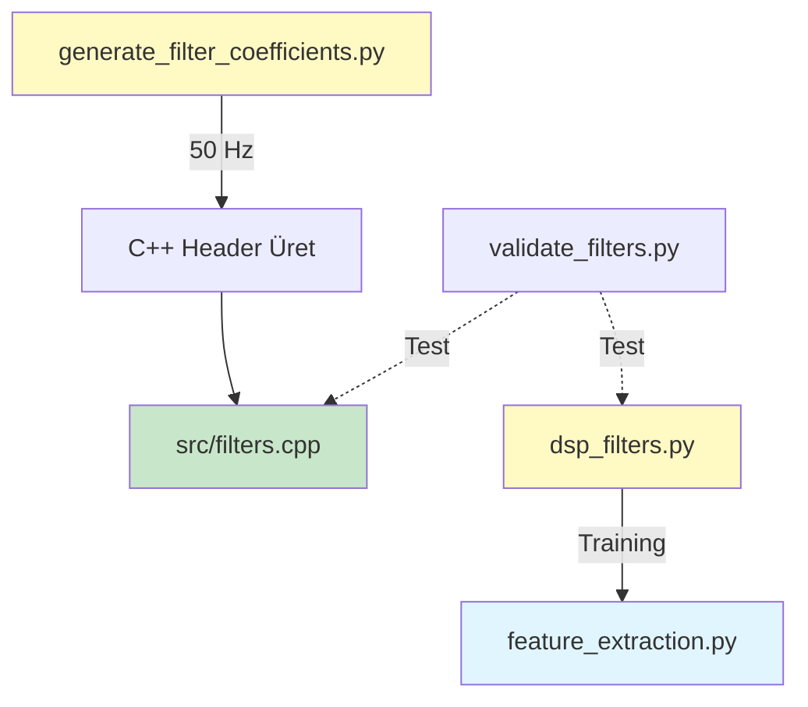

# 🔧 filters/ - DSP Filtre Araçları

Bu klasör, EMG sinyallerinin **filtrelenmesi** için gerekli tüm araçları içerir. Python ve C++ arasında **tam senkronizasyon** sağlar.

---

## 📋 İçindekiler

| Script | Açıklama | Kullanım |
|--------|----------|----------|
| **dsp_filters.py** | Python DSP filtre kütüphanesi | Training pipeline'da kullanılır |
| **generate_filter_coefficients.py** | C++ katsayı üretici | ESP32 firmware için katsayılar |

---

## 1️⃣ dsp_filters.py

### 🎯 Amacı
**Python tarafında** EMG sinyallerini filtrelemek için IIR filter bank sağlar.

### 🔬 Filtre Spesifikasyonları

| Filtre | Tip | Frekans | Order | Amaç |
|--------|-----|---------|-------|------|
| **HPF** | High-Pass Butterworth | 20 Hz | 4th | DC offset + hareket artefaktı |
| **LPF** | Low-Pass Butterworth | 450 Hz | 4th | Yüksek frekans gürültü |
| **Notch** | IIR Notch | 50/60 Hz | 2nd | Powerline gürültüsü |

**Cascade:** HPF → LPF → Notch

---

### ⚙️ SOS (Second-Order Sections) Format

**Neden SOS?**  
- Yüksek order IIR filtrelerde **sayısal kararlılık** sağlar
- Python `scipy.signal` ile doğrudan uyumlu
- Biquad cascade olarak C++'a kolayca dönüştürülebilir

---

### 🚀 Kullanım

#### NumPy Array ile
```python
from filters.dsp_filters import EMGFilterBank

# Filter bank oluştur
filter_bank = EMGFilterBank(
    sampling_rate=2000,      # Hz
    powerline_freq=50,       # 50 Hz (Avrupa) veya 60 Hz (Amerika)
    enable_hpf=True,
    enable_lpf=True,
    enable_notch=True
)

# 1D veya 2D array filtrele
filtered_signal = filter_bank.filter_signal(raw_emg_data)
```

#### Pandas DataFrame ile
```python
import pandas as pd
from filters.dsp_filters import EMGFilterBank

df = pd.read_csv('training_data.csv')
filter_bank = EMGFilterBank(sampling_rate=2000, powerline_freq=50)

# EMG sütunlarını filtrele
filtered_df = filter_bank.filter_dataframe(
    df,
    sensor_columns=['EMG1', 'EMG2', 'EMG3', 'EMG4', 'EMG5', 'EMG6']
)
```

---

### 📊 Frekans Yanıtı Analizi

```python
from filters.dsp_filters import EMGFilterBank

filter_bank = EMGFilterBank(sampling_rate=2000, powerline_freq=50)

# Frekans yanıtını görselleştir
filter_bank.plot_frequency_response(save_path='filter_response.png')

# Numerik yanıt al
freqs, magnitude_db = filter_bank.get_frequency_response(filter_type='cascade')
```

**Çıktı:**
- HPF: -3dB @ 20 Hz
- LPF: -3dB @ 450 Hz
- Notch: -40dB @ 50 Hz (Q=12.5)

---

### ⚙️ Parametreler

#### EMGFilterBank.__init__()

| Parametre | Tip | Varsayılan | Açıklama |
|-----------|-----|------------|----------|
| `sampling_rate` | int | 2000 | Örnekleme frekansı (Hz) |
| `powerline_freq` | int | 50 | Powerline frekansı (50/60 Hz) |
| `enable_hpf` | bool | True | High-pass filtreyi aktif et |
| `enable_lpf` | bool | True | Low-pass filtreyi aktif et |
| `enable_notch` | bool | True | Notch filtreyi aktif et |
| `enable_ma` | bool | False | Moving average (deneysel) |

---

### 🔬 Teknik Detaylar

#### Biquad Cascade
4th-order Butterworth → 2× Biquad stage

```
Input → [Biquad Stage 1] → [Biquad Stage 2] → Output
```

Her biquad:
```
         b0 + b1*z^-1 + b2*z^-2
H(z) = -------------------------
         1  + a1*z^-1 + a2*z^-2
```

#### Zero-Phase Filtering
`scipy.signal.sosfiltfilt()` kullanılır:
- Forward + backward pass
- Phase distortion yok
- **Offline processing için uygundur** (real-time değil)

**Not:** ESP32'de real-time için sadece forward pass yapılır.

---

### ⚠️ C++ Uyumu

**Python ve C++ filtreleri TAM OLARAK aynı sonucu vermeli!**

**Kontrol için:**
```bash
python scripts_ai/validation/validate_filters.py
```

---

## 2️⃣ generate_filter_coefficients.py

### 🎯 Amacı
ESP32 firmware'i için **C++ formatta** filtre katsayıları üretir.

---

### 🚀 Kullanım

#### 50 Hz Powerline (Avrupa, Asya, Afrika)
```bash
python scripts_ai/filters/generate_filter_coefficients.py 50
```

#### 60 Hz Powerline (Amerika, Japonya)
```bash
python scripts_ai/filters/generate_filter_coefficients.py 60
```

---

### 📤 Çıktı

#### 1. Terminal Output
Frekans yanıtı özeti ve C++ kodu:
```
======================================================================
1000 Hz SAMPLING RATE
======================================================================

High-Pass (20 Hz):
  DC gain: -80.23 dB
  -3dB cutoff: 20.1 Hz

Low-Pass (450 Hz):
  Nyquist gain: -60.45 dB
  -3dB cutoff: 449.8 Hz

...
```

#### 2. C++ Header Dosyası
**Dosya:** `../src/filter_coefficients_50hz.h`

```cpp
// ============================================================================
// 1000 Hz SAMPLING RATE (Real-Time Inference)
// ============================================================================
#ifndef DATA_ACQUISITION_MODE

  // High-Pass Filter - Stage 1
  const float HPF_STAGE1_B0 = 0.9565436241f;
  const float HPF_STAGE1_B1 = -1.9130872481f;
  const float HPF_STAGE1_B2 = 0.9565436241f;
  const float HPF_STAGE1_A1 = -1.9111970675f;
  const float HPF_STAGE1_A2 = 0.9149914665f;

  // High-Pass Filter - Stage 2
  ...

#endif
```

---

### 🎓 İki Örnekleme Frekansı

**Neden iki set katsayı?**

| Mod | Sampling Rate | Kullanım |
|-----|---------------|----------|
| **Data Acquisition** | 2000 Hz | Veri toplama (training için) |
| **Real-Time Inference** | 1000 Hz | ESP32'de real-time tahmin |

**Firmware tarafında:**
```cpp
#ifdef DATA_ACQUISITION_MODE
    // 2000 Hz coefficients
#else
    // 1000 Hz coefficients
#endif
```

---

### 📋 Adımlar (Manuel Entegrasyon)

1. **Script'i çalıştır:**
   ```bash
   python scripts_ai/filters/generate_filter_coefficients.py 50
   ```

2. **Çıktıyı kontrol et:**
   ```
   ✅ Coefficients saved to: ../src/filter_coefficients_50hz.h
   ```

3. **C++ projesine ekle:**
   - Kopyala: `src/filter_coefficients_50hz.h`
   - Include et: `#include "filter_coefficients_50hz.h"` in `filters.cpp`

4. **Derle ve test et:**
   ```bash
   pio run
   ```

---

### 🔬 Katsayı Hesaplama

#### High-Pass & Low-Pass (Butterworth)
```python
from scipy import signal

# 4th-order Butterworth
sos = signal.butter(
    N=4,              # Order
    Wn=20,            # Cutoff frequency (Hz)
    btype='high',     # 'high' or 'low'
    fs=sampling_rate, # Sampling frequency
    output='sos'      # Second-Order Sections
)
```

#### Notch Filter
```python
# IIR Notch
b, a = signal.iirnotch(
    w0=50,            # Notch frequency (Hz)
    Q=12.5,           # Quality factor
    fs=sampling_rate
)

# Convert to SOS
sos = np.array([[b[0], b[1], b[2], a[0], a[1], a[2]]])
```

---

### 📊 Frekans Yanıtı Doğrulama

Script otomatik olarak her filtre için:
- DC gain
- -3dB cutoff frekansı
- Nyquist gain

bilgilerini yazdırır.

**Kontrol:**
- HPF cutoff ≈ 20 Hz
- LPF cutoff ≈ 450 Hz
- Notch depth ≈ -40dB @ 50/60 Hz

---

### ⚠️ Önemli Notlar

#### 1. Normalizasyon
SOS katsayıları **a0 ile normalize edilir:**
```python
b0_norm = b0 / a0
b1_norm = b1 / a0
b2_norm = b2 / a0
a1_norm = a1 / a0  # a0 = 1.0
a2_norm = a2 / a0
```

C++ tarafında `a0` her zaman 1.0'dır.

#### 2. Float Precision
**C++:** `float` (32-bit)  
**Python:** `float64` → `float` casting

Küçük sayısal farklar olabilir (~1e-6), **kabul edilebilir**.

#### 3. Powerline Frekansı
**Mutlaka doğru frekansı seçin:**
- Türkiye: **50 Hz** ✅
- ABD: 60 Hz
- Japonya: 50 Hz (Doğu), 60 Hz (Batı)

Yanlış frekans → Notch etkisiz kalır!

---

## 🔄 Tam Filtre Workflow



---

## 🧪 Test ve Validasyon

### Python Filtre Testi
```python
from filters.dsp_filters import test_filters

# Synthetic EMG sinyali ile test
test_filters()
```

**Çıktı:**
- Frequency response plot
- Filtered vs. unfiltered karşılaştırma

### Python-C++ Karşılaştırma
```bash
python scripts_ai/validation/validate_filters.py
```

**Beklenen sonuç:**
```
✅ HPF test passed (difference < 1e-5)
✅ LPF test passed (difference < 1e-5)
✅ Notch test passed (difference < 1e-5)
```

---

## 📚 Literatür ve Standarlar

### EMG Filtering Best Practices

**Band-Pass (20-450 Hz):**
- **Lower cutoff (20 Hz):** Hareket artefaktı ve DC offset
- **Upper cutoff (450 Hz):** EMG yararlı bilgisi 20-450 Hz aralığındadır
- **Referans:** Merletti & Parker (2004) - "Electromyography: Physiology, Engineering, and Non-Invasive Applications"

**Notch Filter:**
- **Powerline interference:** 50/60 Hz ve harmonikleri
- **Q factor (12.5):** Dar bant (sadece 50 Hz), EMG spektrumuna minimal etki

---

## 🐛 Troubleshooting

### Problem: C++ ve Python farklı sonuçlar veriyor
**Çözüm:**
1. Katsayıların güncel olduğundan emin olun
2. Sampling rate doğru mu? (1000 vs 2000 Hz)
3. `validate_filters.py` çalıştırın

### Problem: Notch filter etkisiz
**Çözüm:**
1. Powerline frekansı doğru mu? (50/60 Hz)
2. Sinyal gerçekten 50 Hz gürültüsü içeriyor mu?
3. FFT ile kontrol edin

### Problem: Signal distortion (sinyal bozulması)
**Çözüm:**
1. Filter order'ı düşürün (4 → 2)
2. Cutoff frekanslarını ayarlayın
3. Biquad cascade yerine direct form deneyin

---

## 💡 İpuçları

### Custom Filter Tasarımı
```python
from scipy import signal

# Kendi tasarımınızı yapın
custom_sos = signal.butter(N=2, Wn=30, btype='high', fs=2000, output='sos')

# Filter bank'e manuel ekleyin
filter_bank = EMGFilterBank(...)
filter_bank.hpf_sos = custom_sos
```

### Frequency Response Analizi
```python
import matplotlib.pyplot as plt
from filters.dsp_filters import EMGFilterBank

fb = EMGFilterBank(sampling_rate=2000, powerline_freq=50)

# Her filter için ayrı ayrı
for filter_type in ['hpf', 'lpf', 'notch', 'cascade']:
    freqs, mag_db = fb.get_frequency_response(filter_type)
    plt.plot(freqs, mag_db, label=filter_type)

plt.xlabel('Frequency (Hz)')
plt.ylabel('Magnitude (dB)')
plt.legend()
plt.grid(True)
plt.show()
```

---

**Proje:** ESP32-S3 Bionic Hand  
**Tarih:** 2025
