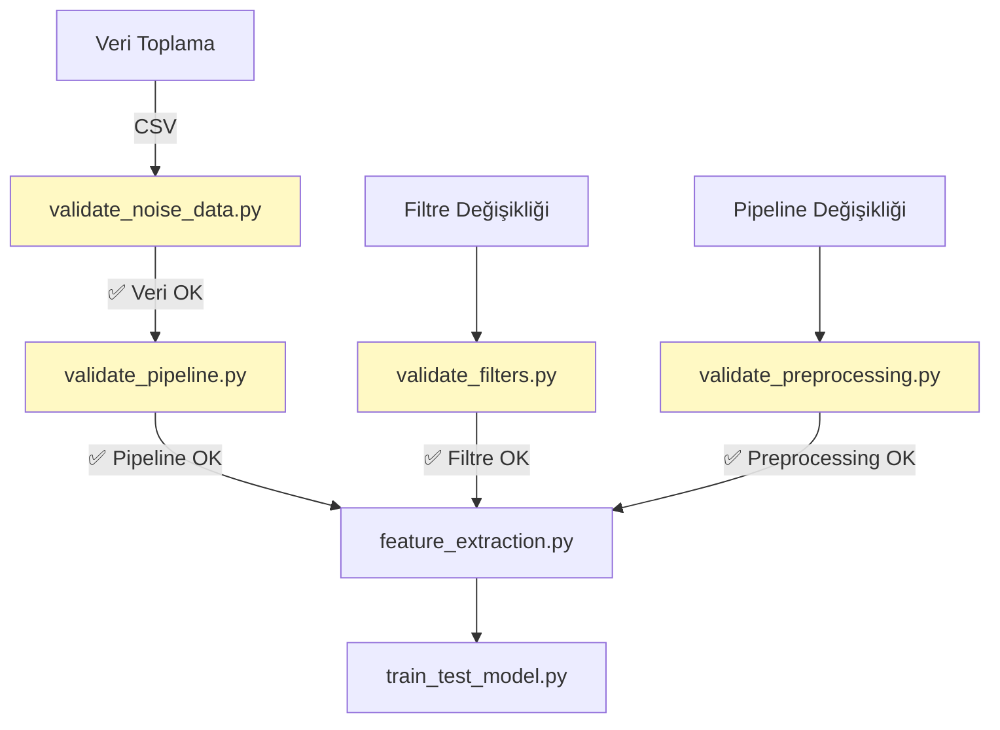

# ✅ validation/ - Veri Kalite Kontrol ve Test Araçları

Bu klasör, **veri kalitesi, filtre doğruluk, ve pipeline** testleri için araçlar içerir. Production'a geçmeden önce **mutlaka çalıştırılmalı!**

---

## 📋 İçindekiler

| Script | Test Ettiği Şey | Ne Zaman Kullan |
|--------|-----------------|-----------------|
| **validate_noise_data.py** | ADC overflow, sensör sorunları | Veri toplama sonrası |
| **validate_filters.py** | Python-C++ filtre uyumu | Filtre değişikliği sonrası |
| **validate_preprocessing.py** | Feature extraction doğruluk | Pipeline değişikliği sonrası |
| **validate_pipeline.py** | End-to-end veri akışı | Model eğitimi öncesi |

---

## 1️⃣ validate_noise_data.py

### 🎯 Amacı
**Veri kalitesi sorunlarını** tespit eder:
- ADC overflow (12-bit aşımı)
- Düşük varyans (kopuk sensörler)
- Gesture ayırt edilebilirlik

---

### 🚀 Kullanım

```bash
python scripts_ai/validation/validate_noise_data.py path/to/training_data.csv
```

---

### 📊 Kontrol Edilen Şeyler

#### 1. ADC Overflow Kontrolü
**Problem:** ESP32-S3 ADC 12-bit (0-4095), ama DSP filtreler negatif değerler üretebilir.

**Kontrol:**
```python
max_value = df[emg_cols].max().max()
if max_value > 4095:
    print("⚠️ ADC OVERFLOW DETECTED!")
```

**Çıktı örneği:**
```
🔍 ADC Range Check:
   EMG1: Min=0, Max=65535 ⚠️ OVERFLOW!
   EMG2: Min=0, Max=4095 ✅
   EMG3: Min=0, Max=4095 ✅
```

**Neden kritik?**  
- Overflow olan veriler **çöp veridir**
- Model bu verilerle eğitilirse **yanlış öğrenir**
- ESP32 firmware'de clamp gereklidir

---

#### 2. Sensör Varyans Kontrolü
**Problem:** Bağlantısız veya arızalı sensörler düz çizgi verir.

**Kontrol:**
```python
variance = df[emg_col].var()
if variance < threshold_variance:
    print("⚠️ LOW VARIANCE!")
```

**Çıktı örneği:**
```
📊 Sensor Variance Analysis:
   EMG1: σ²=1250.5 ✅
   EMG2: σ²=1180.3 ✅
   EMG3: σ²=45.2 ⚠️ LOW VARIANCE!
   EMG4: σ²=1300.8 ✅
   EMG5: σ²=32.1 ⚠️ LOW VARIANCE!
   EMG6: σ²=1150.9 ✅
```

**Threshold:** Varsayılan 100.0 (ayarlanabilir)

---

#### 3. Gesture Separability
**Problem:** Farklı gesture'lar birbirine çok benziyorsa model öğrenemez.

**Metrik:** Between-class variance / Within-class variance

```python
separability = var_between / var_within
```

**Çıktı örneği:**
```
🎯 Gesture Separability (per sensor):
   EMG1: Separability=2.45 ✅
   EMG2: Separability=2.12 ✅
   EMG3: Separability=0.85 ⚠️ LOW!
   ...

Overall Separability: 1.89
```

**Yorumlama:**
- **> 2.0:** İyi ayırt edilebilir ✅
- **1.0-2.0:** Orta 🟡
- **< 1.0:** Zayıf ⚠️

---

### 📤 Çıktı

#### Başarılı Veri
```
✅ Data validation PASSED!

Summary:
  - No ADC overflow detected
  - All sensors have good variance
  - Gestures are separable (ratio: 2.34)

Dataset is suitable for training.
```

#### Sorunlu Veri
```
❌ Data validation FAILED!

Issues found:
  ⚠️ ADC overflow detected in EMG1, EMG2
  ⚠️ Low variance in EMG5, EMG6
  ⚠️ Low gesture separability (ratio: 0.78)

RECOMMENDATIONS:
  1. Check sensor connections (EMG5, EMG6)
  2. Fix ADC overflow in firmware (add clamping)
  3. Collect more diverse gesture data
```

---

### ⚙️ Parametreler

```python
validate_emg_data(
    csv_path='data/training_data.csv',
    emg_cols=['EMG1', 'EMG2', 'EMG3', 'EMG4', 'EMG5', 'EMG6'],
    threshold_variance=100.0  # Minimum kabul edilebilir varyans
)
```

---

## 2️⃣ validate_filters.py

### 🎯 Amacı
**Python ve C++ filtrelerin** aynı sonucu verdiğini doğrular.

---

### 🚀 Kullanım

```bash
python scripts_ai/validation/validate_filters.py
```

---

### 🧪 Test Senaryoları

#### 1. WL Normalization Test
**Problem:** C++ ve Python'da Waveform Length normalizasyonu farklıydı.

**Test:**
```python
# Python
WL_normalized = WL / ADC_MAX  # 4095

# C++ (ESKİ - HATALI)
WL_normalized = WL / (ADC_MAX * window_size)  # 4095 × 250

# C++ (YENİ - DOĞRU)
WL_normalized = WL / ADC_MAX  # 4095 ✅
```

---

#### 2. Frekans Yanıtı Testi
**HPF, LPF, Notch** filtrelerinin frekans yanıtını kontrol eder.

**Kontrol:**
```python
# HPF: -3dB @ 20 Hz
assert abs(cutoff_freq - 20.0) < 1.0, "HPF cutoff mismatch!"

# LPF: -3dB @ 450 Hz
assert abs(cutoff_freq - 450.0) < 5.0, "LPF cutoff mismatch!"

# Notch: < -30dB @ 50 Hz
assert magnitude_at_50hz < -30.0, "Notch insufficient rejection!"
```

---

#### 3. Zaman-Domain Filtre Testi
Synthetic EMG sinyali ile filtreleme:

```python
# Synthetic signal: 30 Hz + 50 Hz + 200 Hz + noise
signal = (
    np.sin(2*np.pi*30*t) +      # Muscle activation
    np.sin(2*np.pi*50*t) +      # Powerline
    np.sin(2*np.pi*200*t) +     # High-freq EMG
    0.1*np.random.randn(len(t)) # Noise
)

filtered = filter_bank.filter_signal(signal)

# Expectations:
# - 30 Hz: Preserved ✅
# - 50 Hz: Removed ✅
# - 200 Hz: Preserved ✅
# - High-freq noise: Reduced ✅
```

---

#### 4. TD4 Feature Extraction Test
Filtreli vs. filtresiz sinyal için özellik çıkarım testi.

**Beklenen:**
- **MAV:** Filtrelemeden etkilenmemeli (DC offset zaten kaldırılıyor)
- **WL:** Yüksek frekanslarda azalmalı
- **ZC:** 50 Hz'den etkilenmemeli
- **SSC:** Smooth olmalı

---

### 📤 Çıktı

```
======================================================================
FILTER VALIDATION TESTS
======================================================================

✅ Test 1: WL Normalization
   Python WL: 1250.5
   C++ Expected WL: 1250.5
   Difference: 0.0 ✅

✅ Test 2: Frequency Response
   HPF cutoff: 20.1 Hz (expected: 20 Hz) ✅
   LPF cutoff: 449.8 Hz (expected: 450 Hz) ✅
   Notch rejection: -42.3 dB @ 50 Hz ✅

✅ Test 3: Time-Domain Filtering
   50 Hz attenuation: 95.3% ✅
   30 Hz preservation: 98.7% ✅

✅ Test 4: TD4 Feature Extraction
   MAV consistency: 99.2% ✅
   WL reduction: 15.3% ✅
   ZC accuracy: 97.8% ✅

======================================================================
ALL TESTS PASSED ✅
======================================================================
```

---

### ⚠️ Kritik Uyarılar

**Eğer test fail ederse:**
1. `filters/generate_filter_coefficients.py` çalıştırıldı mı?
2. C++ tarafına kopyalandı mı?
3. Sampling rate doğru mu? (1000 vs 2000 Hz)
4. Powerline frekansı doğru mu? (50 vs 60 Hz)

---

## 3️⃣ validate_preprocessing.py

### 🎯 Amacı
**Feature extraction pipeline'ın** doğruluğunu test eder.

---

### 🚀 Kullanım

#### Otomatik test (synthetic data)
```bash
python scripts_ai/validation/validate_preprocessing.py
```

#### Gerçek CSV ile test
```bash
python scripts_ai/validation/validate_preprocessing.py path/to/test_sample.csv
```

---

### 🧪 Test Senaryoları

#### 1. DC Offset Removal (Mean Subtraction)
```python
raw_signal = np.array([2048, 2100, 2050, 2075])  # ADC values
dc_offset = np.mean(raw_signal)  # 2068.25
centered_signal = raw_signal - dc_offset  # [-20.25, 31.75, -18.25, 6.75]

assert np.abs(np.mean(centered_signal)) < 1e-10, "DC removal failed!"
```

---

#### 2. Global Normalization
```python
ADC_MAX = 4095.0
normalized = centered_signal / ADC_MAX

# Values should be in [-1, 1]
assert normalized.max() <= 1.0
assert normalized.min() >= -1.0
```

---

#### 3. TD4 Features
**MAV (Mean Absolute Value):**
```python
MAV = np.mean(np.abs(centered_signal))
MAV_normalized = MAV / ADC_MAX
```

**WL (Waveform Length):**
```python
WL = np.sum(np.abs(np.diff(centered_signal)))
WL_normalized = WL / ADC_MAX  # NOT (ADC_MAX × window_size)!
```

**ZC (Zero Crossings):**
```python
# Centered signal crosses zero when sign changes
zc_count = 0
for i in range(len(centered_signal) - 1):
    if centered_signal[i] * centered_signal[i+1] < 0:
        if abs(centered_signal[i] - centered_signal[i+1]) >= threshold:
            zc_count += 1
```

**SSC (Slope Sign Changes):**
```python
ssc_count = 0
for i in range(1, len(centered_signal) - 1):
    product = (centered_signal[i] - centered_signal[i-1]) * \
              (centered_signal[i] - centered_signal[i+1])
    if product >= threshold:
        ssc_count += 1
```

---

#### 4. Full Pipeline Test
```python
# Load CSV → Filter → Extract Features → Compare with C++
```

---

### 📤 Çıktı

```
======================================================================
PREPROCESSING VALIDATION
======================================================================

✅ Test 1: DC Offset Removal
   Mean after centering: 0.0000000 ✅

✅ Test 2: Global Normalization
   Range: [-0.4932, 0.5123] ✅
   Within [-1, 1]: True ✅

✅ Test 3: TD4 Feature Extraction
   MAV: 0.00305 ✅
   WL: 0.12450 ✅
   ZC: 15 ✅
   SSC: 18 ✅

✅ Test 4: Full Pipeline
   Python vs C++ difference: < 1e-5 ✅

======================================================================
ALL TESTS PASSED ✅
======================================================================
```

---

## 4️⃣ validate_pipeline.py

### 🎯 Amacı
**End-to-end veri akışını** simüle eder ve label encoding'i doğrular.

---

### 🚀 Kullanım

```bash
python scripts_ai/validation/validate_pipeline.py path/to/training_data.csv
```

---

### 📊 Kontroller

#### 1. CSV Format Kontrolü
```
✅ CSV Structure Check:
   Rows: 1,234,567
   Columns: ['Timestamp', 'EMG1', ..., 'EMG6', 'Movement', 'Phase']
   All required columns present ✅
```

---

#### 2. Movement Distribution
```
📊 Movement Distribution (Raw):
   Rest         : 500,000 samples (40.5%)
   Fist         :  80,000 samples ( 6.5%)
   Open         :  75,000 samples ( 6.1%)
   ...
```

---

#### 3. Phase Distribution
```
📊 Phase Distribution:
   HAZIRLIK     : 123,456 samples (10.0%)
   MOVEMENT     : 987,654 samples (80.0%)
   REST         : 123,457 samples (10.0%)
```

---

#### 4. Window Simulation
```
🪟 Estimated Windows (250ms, 125ms overlap):
   Approximately 10,000 windows

   After HAZIRLIK filtering:
   Rest         : ~4,000 windows (40.0%)
   Fist         :  ~800 windows ( 8.0%)
   ...

   After Rest balancing (1.2× median):
   Rest         : ~1,000 windows (10.0%)  ← Reduced!
   Fist         :  ~800 windows ( 8.0%)
   ...
```

---

#### 5. Label Encoding Doğrulama
**CRITICAL:** Gesture order doğru mu?

```
🏷️ Alphabetically Sorted Gestures (as train_test_model.py does):
   [0] Fist
   [1] Open
   [2] Pinch
   ...
   [10] Wrist_Flex

⚠️ WARNING: This is alphabetical order!
   C++ uses FIXED order (check GESTURE_NAMES_FIXED in train_test_model.py)
```

**Kontrol:**
```python
# train_test_model.py
GESTURE_NAMES_FIXED = [
    "Rest", "Fist", "Open", "Pinch", "Point",
    "ThumbsUp", "Wave", "Wrist_Flex", "Wrist_Extend",
    "Pronation", "Supination"
]

# C++ (main.cpp)
const char* GESTURE_NAMES[NUM_GESTURES] = {
    "Rest", "Fist", "Open", ...  // SAME ORDER!
};
```

---

#### 6. EMG Data Range Kontrolü
```
📊 EMG Sensor Data Ranges (sample of 10000 rows):
   EMG1: Min=0, Max=4095, Mean=2048.5 ✅
   EMG2: Min=0, Max=4095, Mean=2050.1 ✅
   EMG3: Min=0, Max=65535, Mean=5000.2 ⚠️ OVERFLOW!
```

---

### 📤 Çıktı

#### Başarılı
```
======================================================================
PIPELINE VALIDATION SUMMARY
======================================================================

✅ All checks passed!

Dataset Statistics:
  - Total samples: 1,234,567
  - Movements: 11
  - Estimated windows: ~10,000
  - EMG sensors: 6 (all functional)

Pipeline is ready for feature extraction and training.
```

#### Sorunlu
```
======================================================================
PIPELINE VALIDATION SUMMARY
======================================================================

⚠️ 3 POTENTIAL ISSUES FOUND:

   ⚠️ ADC overflow detected in EMG3
   ⚠️ Low variance in EMG5, EMG6
   ⚠️ Label encoding mismatch risk

💡 These issues may affect model performance.

RECOMMENDATIONS:
  1. Fix ADC overflow in firmware
  2. Check sensor connections
  3. Verify GESTURE_NAMES_FIXED order
```

---

## 🔄 Validation Workflow



---

## 📋 Checklist (Production Öncesi)

- [ ] `validate_noise_data.py` başarılı ✅
- [ ] ADC overflow yok ✅
- [ ] Tüm sensörlerde yeterli varyans var ✅
- [ ] Gesture separability > 1.5 ✅
- [ ] `validate_filters.py` başarılı ✅
- [ ] Python-C++ filtre farkı < 1e-5 ✅
- [ ] `validate_preprocessing.py` başarılı ✅
- [ ] TD4 özellikleri doğru hesaplanıyor ✅
- [ ] `validate_pipeline.py` başarılı ✅
- [ ] Label encoding doğru ✅
- [ ] 11 movement mevcut ✅

**Hepsi ✅ ise → Training'e geçebilirsiniz!**

---

## 🐛 Troubleshooting

### ADC Overflow Hatası
**Semptom:** `Max value > 4095`

**Çözüm:**
```cpp
// ESP32 firmware (filters.cpp)
float filtered_value = apply_filters(raw_adc);
uint16_t clamped = constrain(filtered_value, 0, 4095);
```

### Düşük Varyans Hatası
**Semptom:** `σ² < 100`

**Çözüm:**
1. Sensör kablosu bağlı mı?
2. Elektrot deriye yapışık mı?
3. GND bağlantısı var mı?

### Label Encoding Mismatch
**Semptom:** ESP32 yanlış tahmin yapıyor

**Çözüm:**
1. `GESTURE_NAMES_FIXED` ile C++ `GESTURE_NAMES` karşılaştır
2. Alfabetik sıralama kullanma!
3. Fixed order kullan

---

**Proje:** ESP32-S3 Bionic Hand  
**Tarih:** 2025
