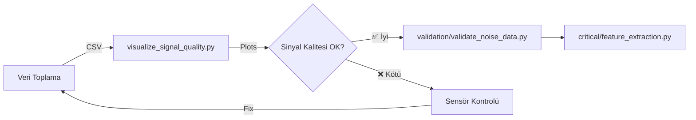

# 📊 visualization/ - Görselleştirme Araçları

Bu klasör, **EMG sinyallerinin kalitesini** analiz etmek ve görselleştirmek için araçlar içerir.

---

## 📋 İçindekiler

| Script | Açıklama | Çıktı |
|--------|----------|-------|
| **visualize_signal_quality.py** | EMG sinyal kalitesi analizi | PNG plots |

---

## 📊 visualize_signal_quality.py

### 🎯 Amacı
Her gesture için **EMG sinyal kalitesini** görselleştirir ve analiz eder.

---

### 🚀 Kullanım

```bash
python scripts_ai/visualization/visualize_signal_quality.py path/to/training_data.csv
```

---

### 📈 Üretilen Görselleştirmeler

#### 1. Signal Samples (Her Gesture için)
**Dosya:** `plots/signal_quality/signal_samples_[gesture].png`

Her gesture için 6 EMG kanalının 1 saniyelik örnek sinyali:

```
EMG1: ~~~~^~~~^~~~~
EMG2: ~~~^~~~~^~~~
EMG3: ~~^~~~~~^~~
EMG4: ~^~~~~~~^~
EMG5: ^~~~~~~~^
EMG6: ~~~~^~~~^~~~~
```

**Fayda:**
- Sinyal kalitesini görsel olarak değerlendirme
- Sensör arızalarını tespit etme
- Gesture pattern'larını inceleme

---

#### 2. Signal Quality Metrics
Her sinyal için:

**Metrikler:**
```python
{
    'mean': 2048.5,          # Ortalama (DC offset)
    'std': 125.3,            # Standart sapma
    'variance': 15700.09,    # Varyans
    'min': 1800,             # Minimum değer
    'max': 2300,             # Maximum değer
    'range': 500,            # Range (max - min)
    'rms': 2051.2,           # Root Mean Square
    'peak_to_peak': 500      # Peak-to-peak amplitude
}
```

**Görselleştirme:**
- Box plot: Her gesture için EMG dağılımı
- Heatmap: Variance matrisi (Sensor × Gesture)
- Time series: Örnek sinyal segmentleri

---

#### 3. Quality Summary
**Dosya:** `plots/signal_quality/quality_summary.png`

**İçerik:**
- Sensor variance comparison
- Gesture separability heatmap
- SNR (Signal-to-Noise Ratio) analizi

---

### 📊 Örnek Çıktı

```
======================================================================
EMG SIGNAL QUALITY ANALYSIS
======================================================================

Processing gestures:
  [1/11] Rest       ✅ (1,234 samples analyzed)
  [2/11] Fist       ✅ (987 samples analyzed)
  [3/11] Open       ✅ (1,045 samples analyzed)
  ...

📊 Sensor Quality Summary:
   EMG1: σ²=1250.5, SNR=18.3 dB ✅
   EMG2: σ²=1180.3, SNR=17.8 dB ✅
   EMG3: σ²=45.2,   SNR=8.2 dB  ⚠️ LOW QUALITY
   EMG4: σ²=1300.8, SNR=19.1 dB ✅
   EMG5: σ²=32.1,   SNR=6.5 dB  ⚠️ LOW QUALITY
   EMG6: σ²=1150.9, SNR=17.2 dB ✅

🎯 Gesture Separability Matrix:
         Rest  Fist  Open  Pinch ...
   EMG1  1.00  0.85  0.92  0.78  ...
   EMG2  1.00  0.88  0.94  0.81  ...
   EMG3  1.00  0.32  0.28  0.25  ... ⚠️ LOW
   ...

✅ Plots saved to: plots/signal_quality/

Files created:
  - signal_samples_Rest.png
  - signal_samples_Fist.png
  - signal_samples_Open.png
  ...
  - quality_summary.png
  - separability_heatmap.png
```

---

### 📂 Çıktı Klasörü Yapısı

```
plots/
└── signal_quality/
    ├── signal_samples_Rest.png
    ├── signal_samples_Fist.png
    ├── signal_samples_Open.png
    ├── signal_samples_Pinch.png
    ├── signal_samples_Point.png
    ├── signal_samples_ThumbsUp.png
    ├── signal_samples_Wave.png
    ├── signal_samples_Wrist_Flex.png
    ├── signal_samples_Wrist_Extend.png
    ├── signal_samples_Pronation.png
    ├── signal_samples_Supination.png
    ├── quality_summary.png
    └── separability_heatmap.png
```

---

### 🔬 Signal Quality Metrics Detayları

#### 1. Variance (σ²)
**Ne ölçer:** Sinyalin değişkenliği

```python
variance = np.var(signal)
```

**Yorumlama:**
- **Yüksek (> 1000):** İyi sinyal, aktif kas aktivitesi ✅
- **Orta (100-1000):** Kabul edilebilir 🟡
- **Düşük (< 100):** Zayıf sinyal, sensör sorunu olabilir ⚠️

---

#### 2. Signal-to-Noise Ratio (SNR)
**Ne ölçer:** Sinyal gücü / Gürültü gücü oranı

```python
signal_power = np.mean(signal**2)
noise_power = np.var(baseline_noise)
SNR_dB = 10 * np.log10(signal_power / noise_power)
```

**Yorumlama:**
- **> 15 dB:** İyi kalite ✅
- **10-15 dB:** Orta kalite 🟡
- **< 10 dB:** Zayıf kalite ⚠️

---

#### 3. Peak-to-Peak Amplitude
**Ne ölçer:** Maksimum sinyal genliği

```python
peak_to_peak = np.max(signal) - np.min(signal)
```

**Yorumlama:**
- **> 500 ADC:** Güçlü kas aktivitesi ✅
- **200-500 ADC:** Orta aktivite 🟡
- **< 200 ADC:** Zayıf aktivite ⚠️

---

### 🎨 Plot Stilleri

**Kullanılan kütüphane:** `seaborn` + `matplotlib`

**Stil:**
```python
sns.set_style("whitegrid")
plt.rcParams['figure.figsize'] = (16, 10)
```

**Renk paleti:**
- Gesture-based: `tab10` (farklı renkler)
- Heatmap: `coolwarm` (düşük=mavi, yüksek=kırmızı)

---

### 🧪 Ne Zaman Kullanılır?

#### 1. Veri Toplama Sonrası
```bash
# İlk veri toplama sonrası kontrol
python scripts_ai/visualization/visualize_signal_quality.py data/training_data.csv
```

**Amaç:** Sensör kalitesini doğrulama, arızaları tespit etme

---

#### 2. Model Accuracy Düşükse
```bash
# Model %30 accuracy veriyorsa
python scripts_ai/visualization/visualize_signal_quality.py data/training_data.csv
```

**Amaç:** Veri kalitesi sorunu var mı kontrol etme

---

#### 3. Yeni Sensör Ekleme
```bash
# Yeni sensör test etme
python scripts_ai/visualization/visualize_signal_quality.py data/new_sensor_test.csv
```

**Amaç:** Yeni sensörün performansını değerlendirme

---

### 💡 Plot Yorumlama İpuçları

#### ✅ İyi Sinyal Özellikleri
```
Signal Sample Plot:
  - Net peaks ve valleys görünür
  - Rest'te düz çizgi (baseline)
  - Gesture'larda belirgin aktivite
  - Tüm kanallar benzer genlikte
```

#### ⚠️ Sorunlu Sinyal Özellikleri
```
Problem Senaryoları:
  1. Düz çizgi (variance=0)
     → Sensör bağlantısız veya arızalı

  2. Aşırı gürültü (high-frequency noise)
     → Kablo interference, filtre gerekli

  3. Tek kanal çok düşük
     → O sensör arızalı veya elektrot kötü

  4. Tüm gesture'lar benzer
     → Sensör konumu yanlış veya kas aktivitesi yok
```

---

### 🔄 Diğer Araçlarla Entegrasyon

**Workflow:**


---

### ⚙️ Parametreler

**Script içinde değiştirilebilir:**

```python
# Analiz edilecek örnek sayısı (per gesture)
SAMPLE_SIZE = 2000  # 1 saniye @ 2000 Hz

# Plot boyutları
FIGURE_SIZE = (16, 10)

# Output directory
OUTPUT_DIR = 'plots/signal_quality'
```

---

### 📚 Ek Özellikler

#### Custom Plot Ekleme
```python
from visualization.visualize_signal_quality import calculate_signal_quality_metrics

# Kendi metriğinizi ekleyin
def custom_metric(signal):
    # Örnek: Median Absolute Deviation
    mad = np.median(np.abs(signal - np.median(signal)))
    return mad

# Kullanım
metrics = calculate_signal_quality_metrics(signal)
metrics['mad'] = custom_metric(signal)
```

---

## 🐛 Troubleshooting

### Problem: Plot boş çıkıyor
**Çözüm:**
```python
# CSV'de yeterli veri var mı kontrol et
df = pd.read_csv('data.csv')
print(df['Movement'].value_counts())
# Her gesture için en az 2000 sample olmalı
```

### Problem: "No display" hatası (WSL/SSH)
**Çözüm:**
```python
# Backend değiştir
import matplotlib
matplotlib.use('Agg')  # GUI gerektirmez
```

### Problem: Heatmap okunamıyor
**Çözüm:**
```python
# Font boyutunu artır
plt.rcParams['font.size'] = 12
sns.heatmap(..., annot=True, fmt='.2f', cmap='coolwarm')
```

---

## 💡 İpuçları

### Toplu CSV Analizi
```bash
# Birden fazla CSV'yi toplu analiz et
for csv in data/*.csv; do
    echo "Analyzing: $csv"
    python scripts_ai/visualization/visualize_signal_quality.py "$csv"
    echo "---"
done
```

### PDF Export (Yüksek Kalite)
```python
# Script içinde
plt.savefig('output.pdf', format='pdf', dpi=300, bbox_inches='tight')
```

### Interaktif Görselleştirme
```python
# Jupyter Notebook'ta kullan
%matplotlib inline

from visualization.visualize_signal_quality import *
visualize_signal_samples(df, sensor_columns)
```

---

**Proje:** ESP32-S3 Bionic Hand  
**Tarih:** 2025
